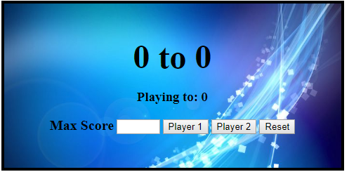
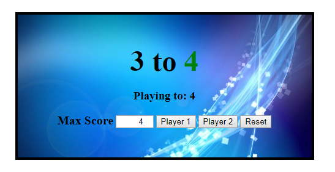

# Score-Keeper
This is a HTML/CSS and Javascript project to help people keep score

The score can be increased or decreased using the number box, either by typing or clicking the up/down arrows.
Once the score has been reached, the scorekeeping will stop and the winner's score will be shown in green.
Hitting reset or changing the max score will reset the scoreboard.

  
  

